# 🐾 FurEver — system zarządzania schroniskiem dla zwierząt

Aplikacja webowa wspierająca pracę schroniska:
pracownicy rejestrują zwierzęta i obsługują wnioski adopcyjne, wolontariusze zapisują się na
dyżury, a adoptujący przeglądają zwierzęta i śledzą status swoich wniosków.

---

## Spis treści

1. [Technologie](#technologie)
2. [Uruchomienie](#uruchomienie)
3. [Konta testowe](#konta-testowe)
4. [Funkcjonalności](#funkcjonalności)
5. [Flow aplikacji](#flow-aplikacji)
6. [Architektura](#architektura)
7. [Baza danych](#baza-danych)
8. [Bezpieczeństwo](#bezpieczeństwo)
9. [Obsługa błędów](#obsługa-błędów)
10. [Testy](#testy)
11. [Scenariusz testowy](#scenariusz-testowy)
12. [Zrzuty ekranu](#zrzuty-ekranu)
13. [Checklista wymagań](#checklista-wymagań)
14. [Struktura projektu](#struktura-projektu)

---

## Technologie

| Warstwa        | Technologia                                             |
|----------------|---------------------------------------------------------|
| Frontend       | HTML5, CSS                                              |
| Backend        | PHP                                                     |
| Baza danych    | PostgreSQL                                              |
| Serwer WWW     | nginx                                                   |
| Infrastruktura | Docker + Docker Compose                                 |
| Testy          | PHPUnit (jednostkowe) + skrypt bash/curl (integracyjne) |

---

## Uruchomienie

Wymagania: Docker + Docker Compose.

```bash
git clone <adres-repozytorium>
cd L01_B

# konfiguracja środowiska
cp .env.example .env        # w razie potrzeby zmień hasło DB itd.

# start całego stosu
docker compose up -d --build
```

| Usługa | Adres |
|---|---|
| Aplikacja | <http://localhost:8080> |
| pgAdmin | <http://localhost:5050> |
| PostgreSQL (z hosta) | `localhost:5433` |

Schemat bazy (`docker/db/init/01_schema.sql`) oraz dane przykładowe
(`docker/db/init/02_seed.sql`) wczytują się **automatycznie** przy pierwszym starcie
(pusty wolumen bazy). Aby zresetować bazę:

```bash
docker compose down -v && docker compose up -d
```

Zmienne środowiskowe opisane są w [`.env.example`](.env.example)
(m.in. `DB_*`, `APP_FORCE_HTTPS`, `SESSION_LIFETIME`, `UPLOAD_MAX_BYTES`).

---

## Konta testowe

Wszystkie konta z seeda mają hasło: **`password`**

| Rola | E-mail | Uprawnienia |
|---|---|---|
| Administrator | `admin@furever.test` | wszystko + zarządzanie użytkownikami |
| Pracownik | `worker@furever.test` | zwierzęta, adopcje, dyżury (CRUD) |
| Wolontariusz | `volunteer@furever.test` | grafik dyżurów, zapisy na zmiany |
| Adoptujący | `adopter@furever.test` | przeglądanie zwierząt, wnioski adopcyjne |

---

## Funkcjonalności

### Uwierzytelnianie i sesje
- rejestracja konta (walidacja e-maila, długości hasła, potwierdzenia hasła),
- logowanie z sesją po stronie serwera (cookie `HttpOnly`, `SameSite=Lax`, regeneracja ID sesji po zalogowaniu),
- wylogowanie (unieważnienie sesji),
- ograniczenie prób logowania (rate limiting per IP + e-mail, tabela `login_attempts`).

### Role i uprawnienia (RBAC)
- 4 role: `admin`, `worker`, `volunteer`, `adopter`,
- każda chroniona akcja kontrolera zaczyna się od `requireAuth([role…])` — uprawnienia
  sprawdzane **w czasie wykonania przy każdym żądaniu**, nie tylko w UI,
- menu boczne renderuje wyłącznie odnośniki dostępne dla danej roli,
- próba wejścia bez uprawnień → strona **403**.

### Zarządzanie zwierzętami (pracownik/admin)
- pełny CRUD: dodawanie, edycja, usuwanie, profil zwierzęcia,
- upload zdjęcia (walidacja typu MIME, rozmiaru, losowa nazwa pliku),
- walidacja formularzy po stronie serwera **i** przeglądarki
  (np. data urodzenia i data przyjęcia nie mogą być z przyszłości),
- żywe filtrowanie listy zwierząt przez **Fetch API** (`/api/animals` zwraca JSON).

### Adopcje
- adoptujący składa wniosek adopcyjny i śledzi jego status („Moje wnioski”),
- pracownik zatwierdza/odrzuca wnioski (przyciski działają przez Fetch API, bez przeładowania),
- zatwierdzenie wniosku wykonuje się w **transakcji SERIALIZABLE** — patrz
  [Baza danych](#baza-danych).

### Wolontariat
- tygodniowy grafik dyżurów z nawigacją po tygodniach,
- pracownik/admin tworzy i usuwa zmiany (walidacja: data nie z przeszłości, koniec po początku),
- wolontariusz zapisuje się i wypisuje ze zmian przez Fetch API,
- widok „Moje dyżury” z nadchodzącymi zobowiązaniami.

### Zarządzanie użytkownikami (admin)
- lista użytkowników, zmiana roli, aktywacja/dezaktywacja konta.

### Pozostałe
- strona główna (landing) z wyszukiwarką i wyróżnionymi zwierzętami,
- dashboard ze statystykami (dane z widoków SQL),
- profil użytkownika (relacja 1:1 `users` ↔ `user_profiles`),
- komunikaty flash (sukces/błąd) po operacjach,
- **responsywny design** — breakpointy `1600px / 1300px / 1200px / 1024px / 768px / 480px`,
  wysuwany sidebar i panel filtrów na urządzeniach mobilnych.

---

## Flow aplikacji

### Cykl życia żądania

```
Przeglądarka ──HTTP──▶ nginx (:8080)
                        ├─ statyki (/public/*) — serwowane bezpośrednio
                        └─ reszta ──FastCGI──▶ php-fpm → index.php
                                                ├─ Autoloader (PSR-4), .env, sesja, error handlery
                                                └─ Routing::dispatch(metoda, ścieżka)
                                                     └─ Router → Kontroler
                                                          ├─ requireAuth() / requireCsrf()
                                                          ├─ Walidacja danych wejściowych
                                                          ├─ Serwis (logika biznesowa, transakcje)
                                                          ├─ Repozytorium (PDO, prepared statements)
                                                          └─ Widok HTML lub odpowiedź JSON (/api/*)
```

### Flow użytkownika — adoptujący

1. Wejście na `/home` → przeglądanie dostępnych zwierząt (filtrowanie po gatunku, wyszukiwarka).
2. Rejestracja (`/register`) → automatyczna rola `adopter` → logowanie (`/login`).
3. Profil zwierzęcia (`/animal?id=…`) → przycisk **„Apply to adopt”** → wniosek trafia do kolejki.
4. `/my-adoptions` → podgląd statusu wniosku (oczekujący / zatwierdzony / odrzucony).

### Flow użytkownika — pracownik

1. Logowanie → `/dashboard` (statystyki schroniska).
2. `/animals` → dodanie nowego zwierzęcia ze zdjęciem.
3. `/adoptions` → zatwierdzenie wniosku → transakcja: wniosek zatwierdzony,
   konkurencyjne wnioski auto-odrzucone, zwierzę oznaczone jako adoptowane.
4. `/volunteers` → utworzenie zmian na nadchodzący tydzień.

### Flow użytkownika — wolontariusz

1. Logowanie → `/volunteers` (grafik tygodniowy) → **„Sign up”** na wybraną zmianę (Fetch API).
2. `/my-shifts` → lista nadchodzących dyżurów, możliwość wypisania się („Drop”).

---

## Architektura

Wzorzec **MVC** z dodatkową warstwą serwisów i repozytoriów.

| Warstwa      | Katalog             | Odpowiedzialność                                                                      |
|--------------|---------------------|---------------------------------------------------------------------------------------|
| Core         | `src/Core/`         | Router, Autoloader (PSR-4), Database (singleton PDO), Session, Csrf, Flash, Env, View |
| Models       | `src/Models/`       | obiekty danych z typowanymi polami, konstruktory nazwane `fromRow()`                  |
| Repositories | `src/Repositories/` | **cały SQL** — wyłącznie prepared statements                                          |
| Services     | `src/Services/`     | logika biznesowa (AuthService, AdoptionService, UploadService, Validator)             |
| Controllers  | `src/Controllers/`  | granica HTTP — parsowanie wejścia, autoryzacja, render widoku / JSON                  |
| Views        | `public/views/`     | szablony HTML z wstawkami PHP, bez logiki biznesowej                                  |

---

## Baza danych

Pełny schemat z danymi przykładowymi: [`docker/db/init/01_schema.sql`](docker/db/init/01_schema.sql)
+ [`docker/db/init/02_seed.sql`](docker/db/init/02_seed.sql) (kompletny eksport SQL — baza
odtwarza się z tych plików od zera).

### Diagram ERD

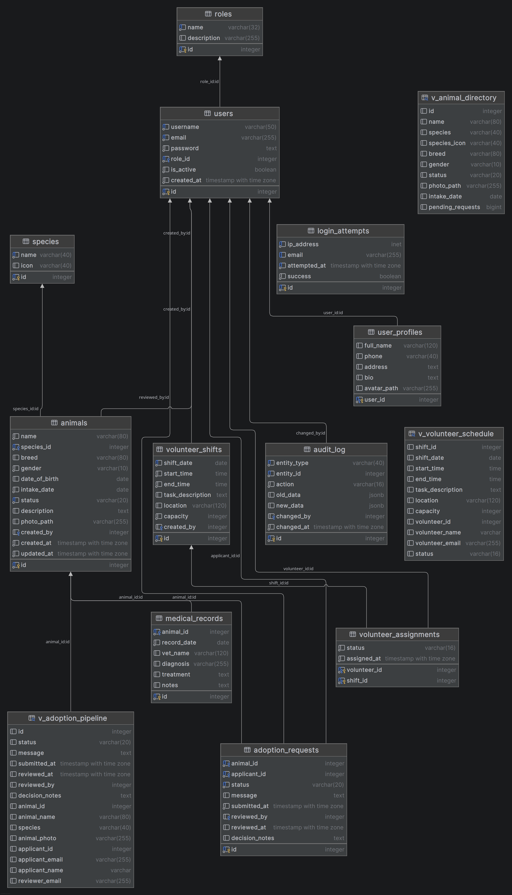

### Relacje — wszystkie trzy rodzaje

| Typ     | Relacja                                                                                                                                                       | Opis                               |
|---------|---------------------------------------------------------------------------------------------------------------------------------------------------------------|------------------------------------|
| **1:N** | `species` → `animals`, `roles` → `users`, `animals` → `adoption_requests`, `animals` → `medical_records`                                                      | klasyczne klucze obce              |
| **M:N** | `users` ↔ `volunteer_shifts` przez tabelę łączącą **`volunteer_assignments`** (PK złożony `volunteer_id + shift_id`, dodatkowe atrybuty: status, data zapisu) | zapisy wolontariuszy na zmiany     |
| **1:1** | `users` ↔ **`user_profiles`** (`user_id` jako PK i FK jednocześnie)                                                                                           | dane profilowe oddzielone od konta |

Akcje kluczy obcych dobrane do semantyki danych: `ON DELETE CASCADE` (np. zapisy na zmiany po
usunięciu zmiany), `ON DELETE SET NULL` (np. autor rekordu po usunięciu konta), `ON UPDATE CASCADE`.

### Widoki

| Widok | Łączy | Przeznaczenie |
|---|---|---|
| `v_animal_directory` | `animals` + `species` + `adoption_requests` (agregacja oczekujących wniosków) | raport katalogu zwierząt |
| `v_adoption_pipeline` | `adoption_requests` + `animals` + `species` + `users` + `user_profiles` (wnioskodawca i recenzent) | **używany przez aplikację** — kolejka adopcyjna (`AdoptionsRepository`) |
| `v_volunteer_schedule` | `volunteer_shifts` + `volunteer_assignments` + `users` + `user_profiles` | raport grafiku dyżurów |

### Funkcja

**`fn_animal_age_months(p_animal_id INT) → INT`** (PL/pgSQL) — wiek zwierzęcia w miesiącach
liczony z daty urodzenia, z fallbackiem na datę przyjęcia do schroniska, gdy data urodzenia
jest nieznana.

### Trigger

**`tr_animals_audit`** — `AFTER INSERT OR UPDATE OR DELETE ON animals`, wywołuje funkcję
`trg_audit_animal_change()`, która zapisuje do tabeli **`audit_log`** pełny stan wiersza
przed i po zmianie (`to_jsonb(OLD)` / `to_jsonb(NEW)`). Każda operacja na zwierzętach
zostawia ślad audytowy.

```sql
-- weryfikacja: po edycji dowolnego zwierzęcia w aplikacji
SELECT entity_id, action, changed_at FROM audit_log ORDER BY changed_at DESC LIMIT 5;
```

### Transakcje na odpowiednim poziomie izolacji

`AdoptionService::approve()` zatwierdza wniosek w transakcji **SERIALIZABLE**:

1. `SELECT … FOR UPDATE` — blokada wiersza zwierzęcia,
2. weryfikacja, że zwierzę jest nadal dostępne,
3. zatwierdzenie wniosku (z warunkiem na status — ochrona przed równoległą modyfikacją),
4. automatyczne odrzucenie pozostałych oczekujących wniosków na to samo zwierzę,
5. zmiana statusu zwierzęcia na `adopted`,
6. `COMMIT` / `ROLLBACK` przy błędzie.

Dzięki temu dwóch pracowników nie zatwierdzi jednocześnie dwóch wniosków na jedno zwierzę.

### Normalizacja

Schemat w **3NF** — brak redundancji (np. nazwa gatunku tylko w `species`, dane profilowe
tylko w `user_profiles`), brak anomalii modyfikacji i usuwania. Słowniki (`roles`, `species`)
wydzielone do osobnych tabel.

---

## Bezpieczeństwo

- **Hasła**: `password_hash(…, PASSWORD_BCRYPT)` + `password_verify()` — nigdzie nie ma haseł jawnym tekstem.
- **SQL Injection**: wyłącznie PDO prepared statements, `ATTR_EMULATE_PREPARES = false`, `ERRMODE_EXCEPTION`.
- **XSS**: każde wyjście w widokach przechodzi przez `htmlspecialchars()`.
- **CSRF**: token w sesji; każdy formularz POST zawiera pole `_csrf`, każdy request Fetch wysyła
  nagłówek `X-CSRF-Token`; weryfikacja `hash_equals()` w `AppController::requireCsrf()`.
- **Sesje**: cookie `HttpOnly`, `SameSite=Lax`, `Secure` przy HTTPS; regeneracja ID po zalogowaniu.
- **Brute force**: limit prób logowania per IP + e-mail (tabela `login_attempts`).
- **Upload plików**: walidacja typu MIME (finfo), limit rozmiaru, losowa nazwa pliku, zapis poza ścieżką wykonywalną.
- **Walidacja wejścia**: serwerowa (`Validator`: required, email, min/maxLength, in, date,
  notFuture, notPast) + atrybuty HTML (`required`, `max`, `min`) jako pierwsza linia obrony.
- **RBAC w runtime**: `requireAuth([role…])` na początku każdej chronionej akcji.
- **Ukrywanie szczegółów błędów**: użytkownik widzi tylko ogólną stronę 500, szczegóły trafiają do logów serwera.

---

## Obsługa błędów

Globalna obsługa błędów — dedykowane, samodzielne strony:

| Kod     | Kiedy                                                                                                |
|---------|------------------------------------------------------------------------------------------------------|
| **400** | niepoprawne żądanie / błędny token CSRF / zła metoda HTTP                                            |
| **403** | brak uprawnień do zasobu (np. adoptujący wchodzi na `/users`)                                        |
| **404** | nieistniejąca ścieżka lub rekord                                                                     |
| **500** | nieobsłużony wyjątek — szczegóły logowane przez `error_log`, użytkownik widzi tylko ogólny komunikat |

Router przechwytuje każdy wyjątek z kontrolerów.

---

## Testy

### Jednostkowe (PHPUnit)

```bash
docker compose exec php sh -c 'cd /app && vendor/bin/phpunit'
```

Pokrywają m.in. `AuthService` (rejestracja, logowanie, błędne hasło) i logikę repozytorium adopcji.

### Integracyjne (bash + curl)

```bash
bash tests/integration/smoke.sh
```

Skrypt przechodzi przez działającą aplikację: logowanie (sesja + cookie), dostęp do stron
chronionych, **403** dla roli bez uprawnień, przekierowania po wylogowaniu — 8 asercji.

---

## Scenariusz testowy

1. **Start**: `docker compose up -d --build` → otwórz <http://localhost:8080>.
2. **Strona publiczna**: `/home` — lista dostępnych zwierząt widoczna bez logowania.
3. **Rejestracja**: załóż konto na `/register` (walidacja: e-mail, min. długość hasła,
   zgodność haseł). Nowe konto dostaje rolę `adopter`.
4. **Logowanie**: zaloguj się na nowe konto → przekierowanie na `/dashboard`.
5. **Uprawnienia (403)**: jako adoptujący wejdź na `/users` → strona **403 Forbidden**.
6. **Wniosek adopcyjny**: otwórz profil zwierzęcia → „Apply to adopt” → sprawdź `/my-adoptions` (status: pending).
7. **Przeloguj na pracownika** (`worker@furever.test` / `password`).
8. **CRUD zwierząt**: dodaj zwierzę ze zdjęciem; spróbuj wpisać przyszłą datę urodzenia →
   walidacja odrzuca. Edytuj i usuń testowe zwierzę.
9. **Trigger**: po edycji sprawdź w pgAdmin: `SELECT * FROM audit_log ORDER BY changed_at DESC;`
   → wpisy INSERT/UPDATE/DELETE z pełnym JSON-em zmian.
10. **Transakcja**: w `/adoptions` zatwierdź wniosek → pozostałe wnioski na to zwierzę
    automatycznie odrzucone, zwierzę znika z listy dostępnych.
11. **Widoki i funkcja SQL**: kolejka `/adoptions` czyta z widoku `v_adoption_pipeline`;
    w pgAdmin sprawdź pozostałe: `SELECT * FROM v_animal_directory;`,
    `SELECT * FROM v_volunteer_schedule;`, `SELECT fn_animal_age_months(1);`.
12. **Wolontariat**: zaloguj się jako `volunteer@furever.test` → `/volunteers` → „Sign up”
    na zmianę (bez przeładowania strony) → po odświeżeniu status „Joined” zostaje;
    `/my-shifts` → „Drop” wypisuje ze zmiany.
13. **Admin**: zaloguj się jako `admin@furever.test` → `/users` → zmień rolę / dezaktywuj konto.
14. **404**: wejdź na `/nieistniejaca-strona` → strona 404.
15. **Wylogowanie**: wyloguj się → próba wejścia na `/dashboard` przekierowuje na `/login`.
16. **RWD**: zwęź okno przeglądarki (lub DevTools, tryb mobilny 375 px) — sidebar chowa się
    do hamburgera, tabele i siatki przeskakują na układ jednokolumnowy, brak poziomego scrolla.

---

## Zrzuty ekranu

> Zrzuty znajdują się w katalogu [`docs/screenshots/`](docs/screenshots/).

### Wersja desktopowa

| Strona                         | Zrzut                                                           |
|--------------------------------|-----------------------------------------------------------------|
| Strona główna (landing)        | 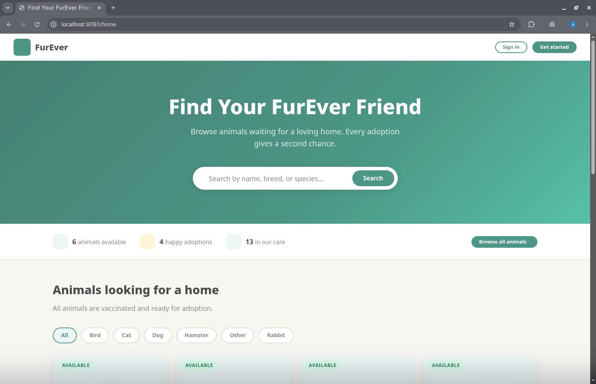                 |
| Logowanie                      | 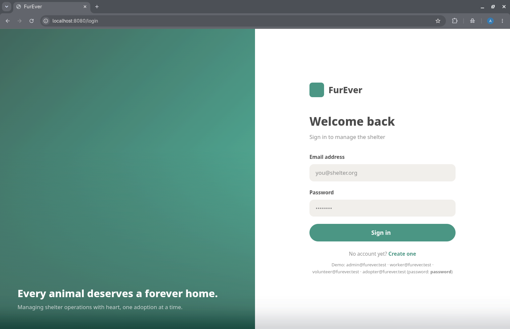                    |
| Rejestracja                    | 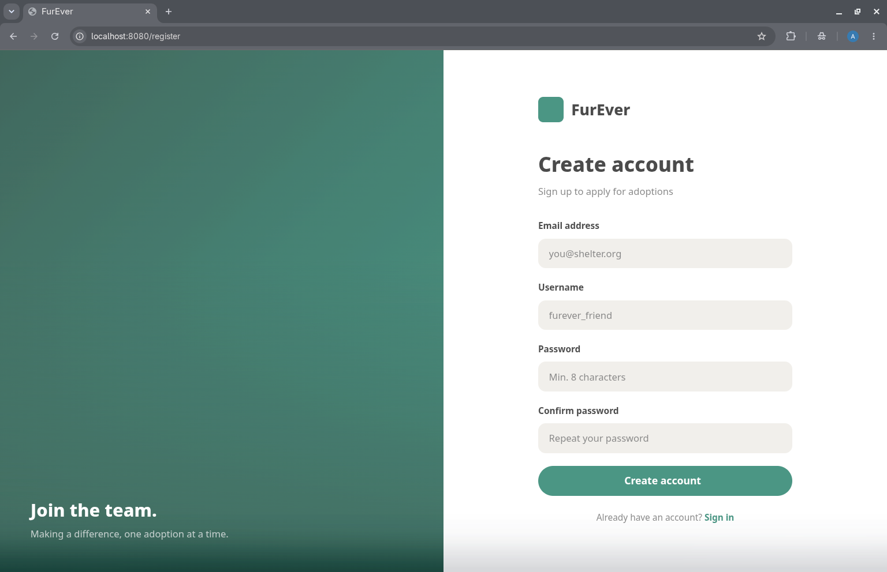               |
| Dashboard                      | 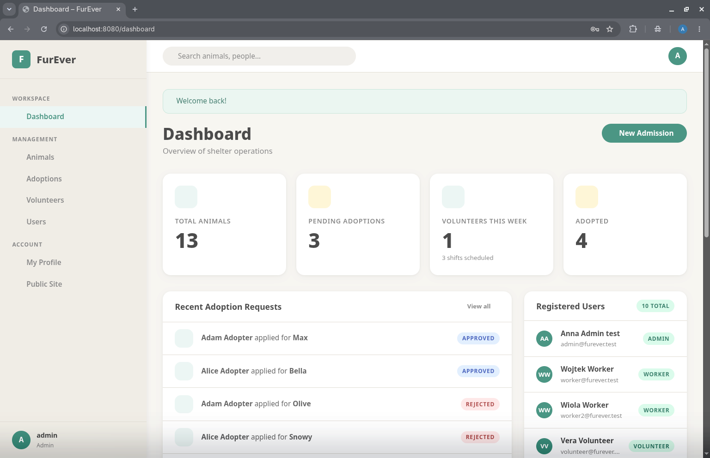                |
| Katalog zwierząt + filtry      | 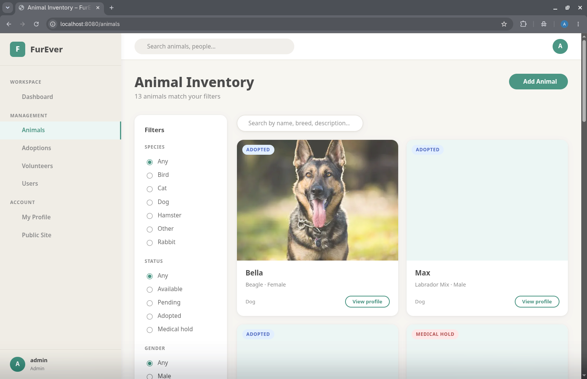                  |
| Profil zwierzęcia              | 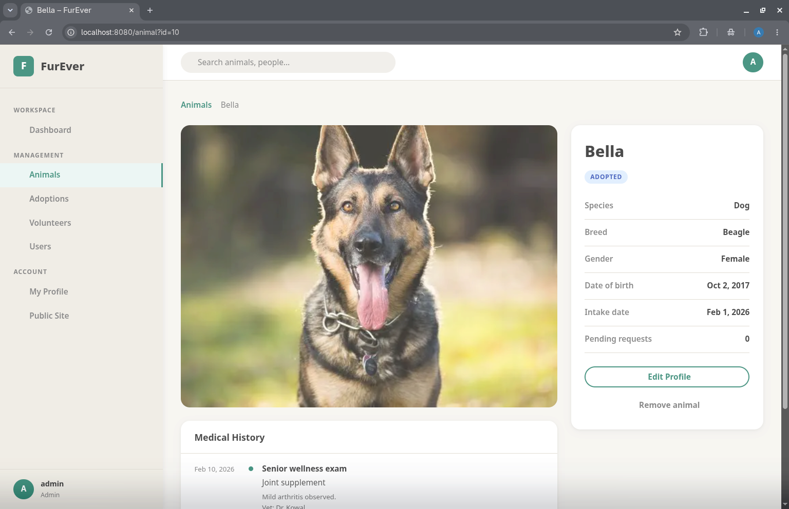   |
| Formularz dodawania zwierzęcia | 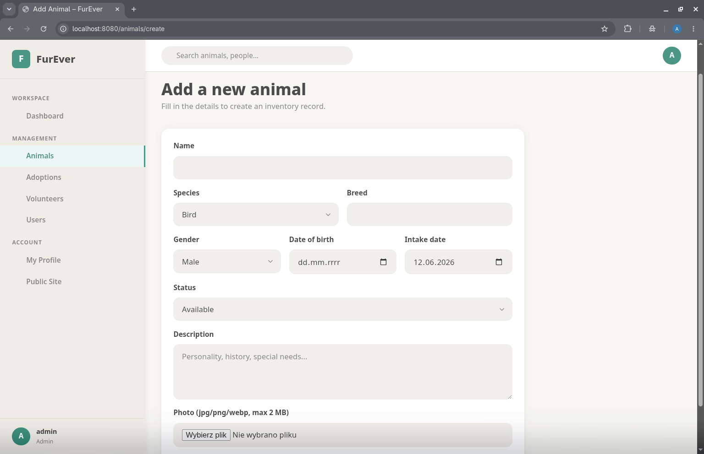 |
| Kolejka adopcyjna              | 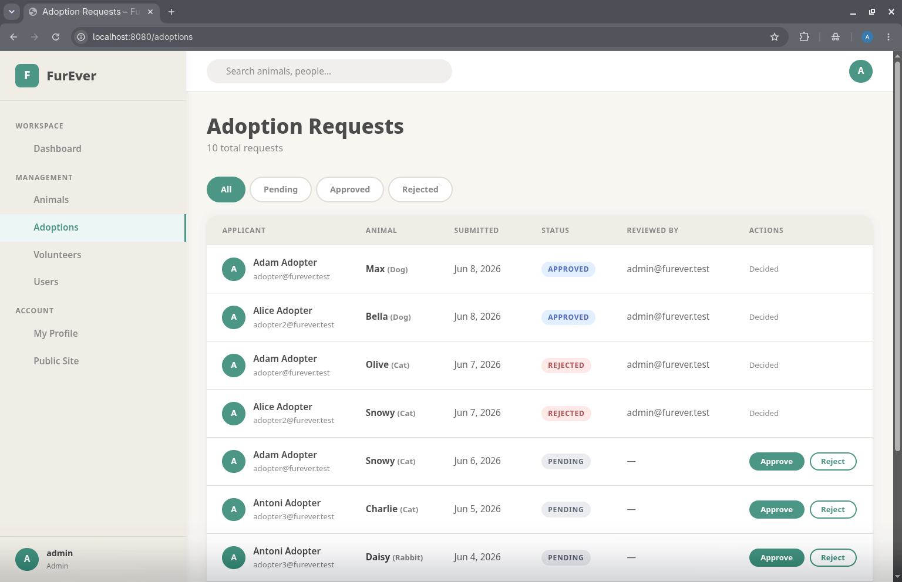                  |
| Grafik wolontariuszy           | 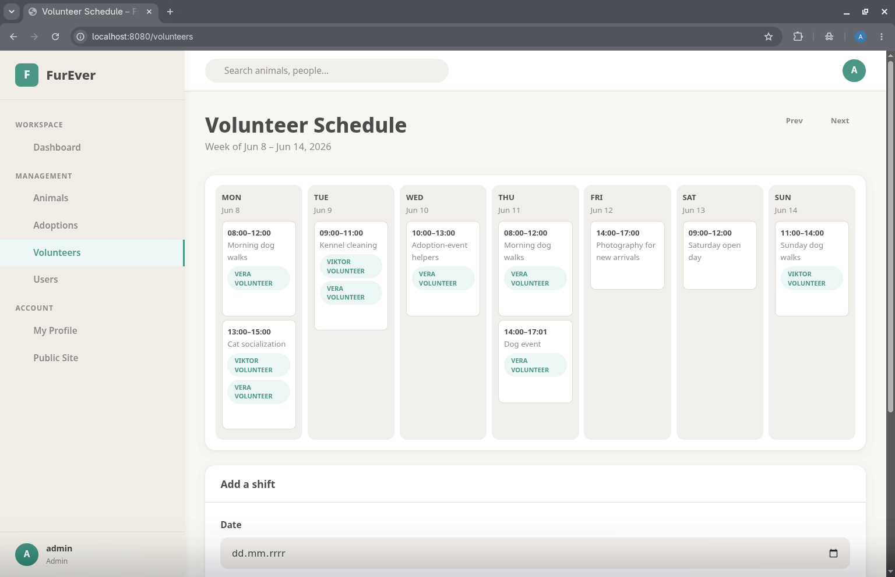           |
| Zarządzanie użytkownikami      | 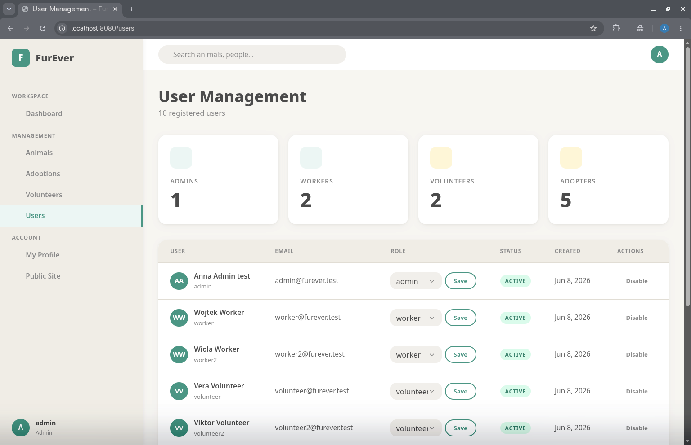                  |
| Strona błędu 404               | 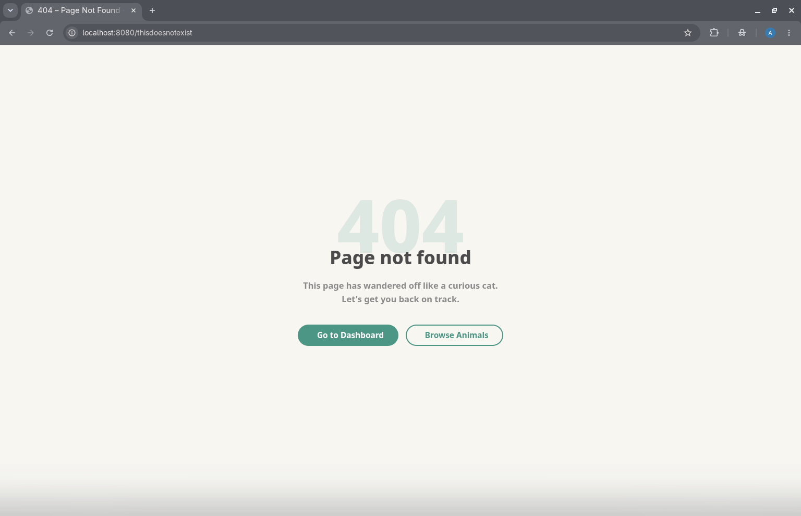                            |

### Wersja mobilna

| Strona                       | Zrzut                                                            |
|------------------------------|------------------------------------------------------------------|
| Strona główna                | 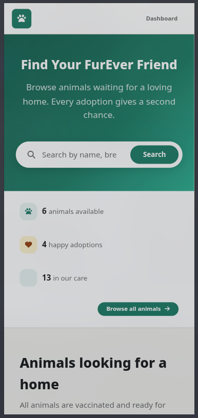       |
| Dashboard + menu (hamburger) | 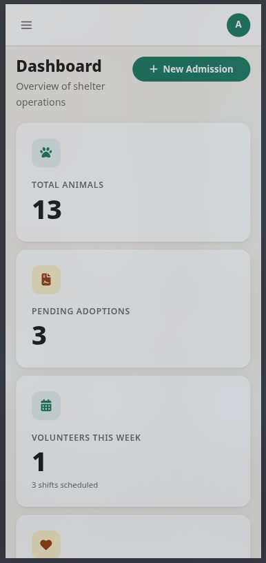      |
| Katalog zwierząt             | 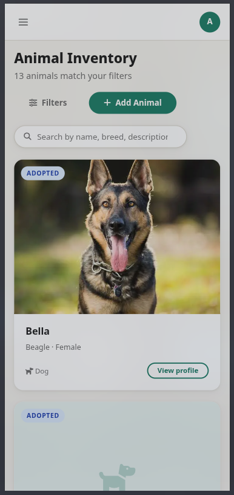        |
| Grafik wolontariuszy         | 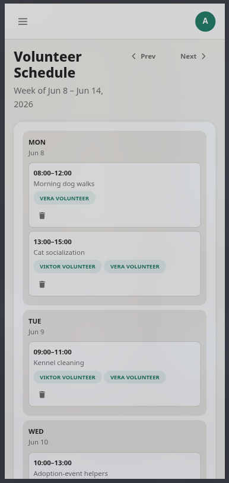 |

---

## Struktura projektu

```
.
├── docker-compose.yaml         # nginx :8080 · php-fpm · postgres :5433 · pgadmin :5050
├── docker/
│   ├── nginx/ php/             # obrazy / konfiguracja kontenerów
│   └── db/init/
│       ├── 01_schema.sql       # schemat: tabele, widoki, funkcja, trigger
│       └── 02_seed.sql         # dane przykładowe (konta testowe, zwierzęta, zmiany)
├── index.php                   # punkt wejścia (bootstrap + dispatch)
├── Routing.php                 # definicje tras (GET/POST + parametry {id})
├── src/
│   ├── Core/                   # Router, Autoloader, Database, Session, Csrf, Flash, Env, View
│   ├── Controllers/            # Security, Home, Dashboard, Animals, Adoptions, Volunteers, Users, Profile, Error
│   ├── Services/               # AuthService, AdoptionService, UploadService, Validator
│   ├── Repositories/           # cały SQL (PDO prepared statements)
│   └── Models/                 # Animal, AdoptionRequest, User, Role, VolunteerShift, …
├── public/
│   ├── views/                  # szablony HTML + partiale (head, sidebar, topbar, flashes)
│   ├── styles/                 # base / layout / auth / components / pages
│   ├── scripts/                # app / animals / adoptions / volunteers (Fetch API)
│   └── uploads/animals/        # zdjęcia zwierząt
├── tests/
│   ├── Unit/                   # PHPUnit
│   └── integration/smoke.sh    # testy integracyjne curl/bash
└── docs/
    ├── architecture.md         # diagram warstwowy + cykl życia żądania
    ├── erd.md                  # diagram ERD (Mermaid)
    └── screenshots/            # zrzuty ekranu web + mobile
```
