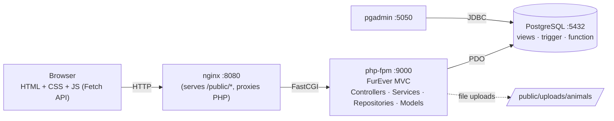

# FurEver — Architecture

## Request lifecycle

1. The browser sends an HTTP request to nginx on port 8080.
2. nginx serves static assets directly (`/public/styles/*`, `/public/scripts/*`, uploaded animal photos).  
   For everything else it forwards the request via FastCGI to the `php` container's `index.php`.
3. `index.php` boots: registers the PSR-4 autoloader, loads `.env`, starts the session, installs error handlers, and calls `Routing::dispatch($method, $path)`.
4. `FurEver\Core\Router` matches the route → `Controller::method()`.
5. The controller validates input, calls a Service for business logic, and asks a Repository for data.
6. The Repository talks to PostgreSQL through a single `Database::getInstance(): PDO` (singleton).
7. The controller renders an HTML view (output-buffered, `extract()`-ed variables) or returns JSON for `/api/*` endpoints used by the Fetch-driven UI.

## Layers

| Layer | Folder | Responsibility |
|-------|--------|----------------|
| Core  | `src/Core/`        | Autoloader, env, session, CSRF, flash, Database singleton, Router, View helper |
| Models | `src/Models/`     | Plain-old data carriers — typed properties, named constructors via `fromRow()` |
| Repositories | `src/Repositories/` | All SQL lives here; prepared statements only |
| Services | `src/Services/` | Business logic & cross-cutting policies (auth, transactions, uploads, validation) |
| Controllers | `src/Controllers/` | HTTP boundary — input parsing, auth gating, view rendering |
| Views | `public/views/`     | HTML templates with embedded `<?php ?>`. No business logic. |

## Security posture

- Sessions: `httponly`, `samesite=Lax` cookie; session ID regenerated on login.
- CSRF: token in session; every POST form embeds `_csrf` and every fetch sends `X-CSRF-Token`. Verified in `AppController::requireCsrf()`.
- RBAC: `requireAuth([roles])` at the start of every protected controller method. The sidebar partial only renders links the role can reach.
- Passwords: `password_hash(..., PASSWORD_BCRYPT)` / `password_verify`.
- DB: PDO with `ATTR_EMULATE_PREPARES = false`, `ERRMODE_EXCEPTION`. All queries are parameterised.
- Uploads: MIME sniff via `finfo`, size cap from `UPLOAD_MAX_BYTES`, randomised filenames in `/public/uploads/animals/`.
- Errors: `set_exception_handler` and `set_error_handler` route to `ErrorController`. Production hides exception detail; development shows the stack.

## Why no framework

The assignment forbids frameworks. Equivalent ergonomics are achieved with:
- A custom **PSR-4 autoloader** (`src/Core/Autoloader.php`) — Composer optional.
- A small **router** with method + path-parameter support (`src/Core/Router.php`).
- A handful of **services** instead of magic dependency injection.
- A **`Database::getInstance()`** singleton instead of an ORM.
