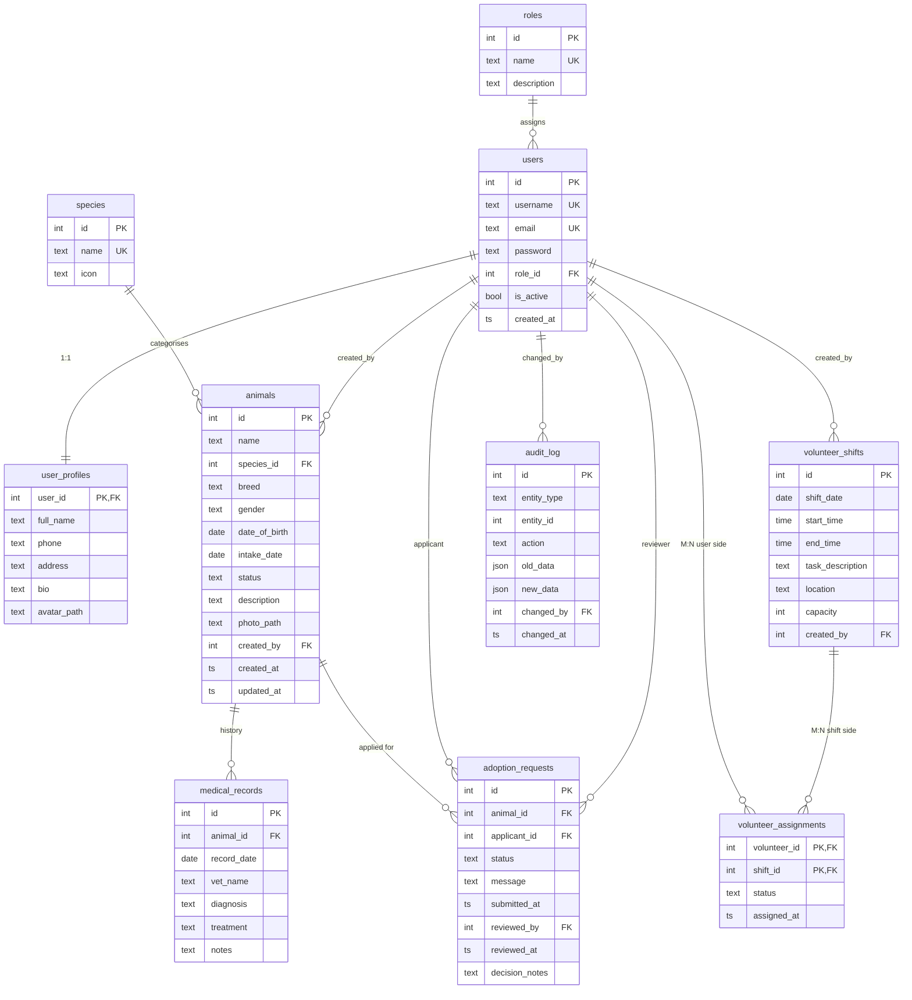

# FurEver — Entity-Relationship Diagram

Authoritative source: `docker/db/init/01_schema.sql`. The diagram below mirrors that file. To produce a PNG, paste this Mermaid block into <https://mermaid.live> or render it directly on GitHub.

## Relationship coverage

| Type | Where |
|------|-------|
| 1:1  | `users` ↔ `user_profiles` (PK on user_id is also FK to users) |
| 1:N  | `roles` → `users`, `species` → `animals`, `animals` → `medical_records`, `animals` → `adoption_requests`, `users` (applicant) → `adoption_requests`, `users` → `volunteer_shifts.created_by` |
| M:N  | `users` ↔ `volunteer_shifts` via `volunteer_assignments` (composite PK) |

## Database extras (assignment requirements)

| Required | Implementation | File |
|----------|----------------|------|
| ≥ 2 multi-table views | `v_animal_directory`, `v_adoption_pipeline`, `v_volunteer_schedule` | `docker/db/init/01_schema.sql` |
| ≥ 1 trigger | `tr_animals_audit` (AFTER INSERT/UPDATE/DELETE on animals) writes JSONB diff to `audit_log` | same |
| ≥ 1 function | `fn_animal_age_months(p_animal_id)` | same |
| Transaction at non-default isolation | `AdoptionService::approve()` runs inside `SET TRANSACTION ISOLATION LEVEL SERIALIZABLE` with row-level `SELECT … FOR UPDATE` | `src/Services/AdoptionService.php` |
| FK actions with JOINs | `ON DELETE CASCADE` on profile, medical, adoption, assignment; `RESTRICT` on roles/species; `SET NULL` on optional reviewer/creator references; views demonstrate the JOINs | schema |
| 3NF / no redundancy | All non-key attributes depend only on the PK; lookup data lives in `roles` and `species`; no derived columns stored | schema |
